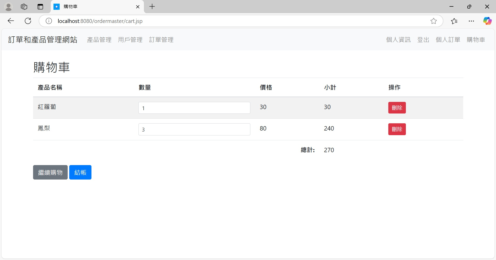

# 前言
今日課堂老師新教 Spring boot, 趁此機會自己練習寫一個作業, 主題是訂單管理。 

# 專案目的：
這個專案是設計為一個簡易的 訂單管理系統，具備以下核心功能： 
## 1.訂單管理：
用戶可以透過平台進行商品選擇並下單，系統會記錄訂單的詳細資料，包括訂單項目、數量、價格等。 
系統支持查詢、更新及刪除訂單，並顯示訂單的詳細內容。 
管理員可進行訂單的全覽、搜尋及管理，並進行詳細的訂單處理。 

## 2.用戶管理：
用戶可以進行註冊、登入、登出操作，並管理其個人資訊。 
系統支援用戶登錄後查看及管理其歷史訂單。 
管理員可查看所有用戶資料，並可進行用戶管理操作（如禁用、刪除用戶等）。 

## 3.產品管理：
管理員可以上傳、修改和刪除產品。 
系統會顯示產品詳細資料，包括名稱、價格、庫存量等。 
用戶可瀏覽和選擇商品進行購買。 

## 4.購物車功能：
用戶可以將產品加入購物車，並在結帳時選擇相應商品進行支付。 

## 5.後台管理：
管理員可在後台頁面管理訂單、產品和用戶，進行商品庫存、訂單狀態更新等操作。 
系統提供訂單搜尋及篩選功能，幫助管理員有效管理訂單。 

# 技術架構：
## 前端：
使用 JSP 技術作為前端模板，配合 JavaScript 進行動態頁面更新。CSS 用於頁面樣式設計，並且包含不同頁面的樣式配置，例如訂單管理、用戶管理、產品管理等。
## 後端：
使用 Spring Boot 作為後端框架，提供 RESTful API 來處理訂單、產品及用戶管理等功能。資料存取層使用 Spring Data JPA 來與 MySQL 資料庫進行互動。
## 資料庫：
資料庫設計包括用戶、訂單、訂單項目、產品等表，並且管理各種數據的持久化與關聯。
## 功能模組：
controller 層： 負責處理請求並返回對應的資料或視圖。 
service 層： 執行業務邏輯處理，協調各種服務。 
repository 層： 通過 Spring Data JPA 操作資料庫，提供 CRUD 操作。 
model 層： 定義系統的主要資料結構，包括訂單、訂單項目、產品和用戶等。 
安全性：註冊與登入流程確保用戶帳號的安全，並進行基礎的權限控制，確保管理員和一般用戶的操作範圍分開。 

# 主要功能介紹：
## 訂單管理：
訂單查詢： 管理員可以查看所有訂單或通過訂單號進行搜尋。 
訂單詳細資料： 顯示訂單的具體內容，如訂單項目、價格、數量等。 
訂單狀態管理： 管理員可以修改訂單狀態（如處理中、已完成、已取消等）。 
## 用戶管理：
用戶資料管理： 管理員可以管理用戶資料，修改用戶角色，或禁用/刪除用戶。 
用戶訂單查詢： 用戶可查詢自己的歷史訂單記錄，並進行相關操作。 
## 產品管理：
產品上架與管理： 管理員可新增、修改、刪除產品，並管理產品庫存。 
產品詳情查看： 用戶可以瀏覽產品資訊並將其加入購物車。 
## 購物車及結帳：
加入購物車： 用戶可以將選中的商品加入購物車。 
結帳流程： 用戶確認訂單後結帳，並扣除相應庫存。 

# 📖 使用手冊
## 1.匯入 MySQL Schema 和 Table
請下載 SQL 目錄的檔案，並按照以下步驟將其匯入 MySQL： 
打開 MySQL Workbench。 
連接到 MySQL 伺服器。 
在左側資料庫樹狀中，選擇要匯入資料的資料庫。 
在 MySQL Workbench 上方的「管理」標籤下，選擇 資料匯入。 
選擇要匯入的檔案（例如 shoppingmall 開頭的.sql）。 
點擊 開始匯入。 
匯入完成後，資料庫中的 Schema 和表格應已成功設置。 

## 2.準備好 Tomcat 可執行環境
下載 ordermaster.war , 並置於適當位置  

# 🖥️ 使用介面介紹-前台-使用者登入

# 🖥️ 使用介面介紹-前台-購物車

# 🖥️ 使用介面介紹-前台-我的訂單

# 🖥️ 使用介面介紹-前台-我的訂單詳情

# 🖥️ 使用介面介紹-前台-管理者登入

# 🖥️ 使用介面介紹-前台-產品管理

# 待施作項目

# 以上是專案說明

